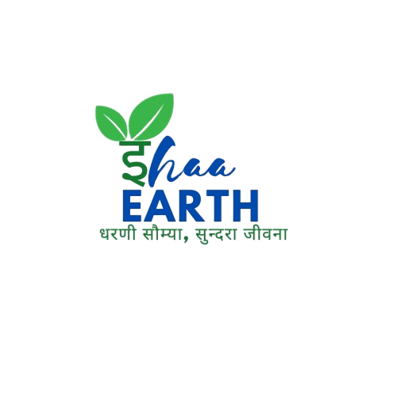

    

# EHAA Earth - Advanced Air Purification 🌍

EHAA Earth is a cutting-edge environmental technology initiative focused on revolutionizing indoor air quality. This project houses the official web portal for EHAA Earth, showcasing a premium range of sustainable air purifiers designed for homes, offices, and mobile lifestyles.

---

## ✨ Project Overview

EHAA Earth combines advanced hardware engineering with high-performance web design to deliver environmental solutions that are efficient, durable, and affordable. Our technology targets common contaminants including dust, pollen, volatile organic compounds (VOCs), and harmful gases (COx, NOx, SOx), ensuring a healthier living space for everyone.

### Key Highlights:
- **CleanAir Pro Series**: High-performance filtration for large spaces.
- **PureZone & OfficeGuard**: Specialized solutions for professional environments.
- **Portable Solutions**: TravelAir and PocketPurifier for clean air on the go.
- **Smart Connectivity**: IoT-enabled devices for real-time air quality monitoring.

---

## 🎨 Visual Excellence

This web portal utilizes modern web standards to provide a premium, interactive user experience:
- **Liquid Smooth Animations**: Powered by **GSAP** and **ScrollReveal**.
- **Adaptive Themes**: Seamless Dark/Light mode transitions with persistent memory.
- **Modular Design**: A scalable architecture for easy expansion of product lines and research data.
- **Responsive Layout**: Pixel-perfect experience across all device form factors.

---

## 🏗 Project Structure

- `assets/`: Central hub for modular CSS, core JavaScript logic, and optimized image/SVG assets.
- `products/`: Dedicated deep-link architecture for multi-category product discovery.
- `blogs/`: A repository of scientific research papers and environmental studies.
- `CNAME`: Configuration for custom domain hosting.

---

## ❤️ Show Your Support

This project is a labor of love for environmental sustainability and modern web development. 

**If you find this project inspiring or useful, please consider giving it a ⭐ star!** Your support helps drive the mission of cleaner air for all.

---

## 🛡 License

This project is protected under a **Proprietary License**. Unauthorized copying of the source code or the unique visual design is strictly prohibited. See the [LICENSE](./LICENSE) file for full details.

Developed with passion by **Sai Mehar** and the **EHAA Earth Team**.